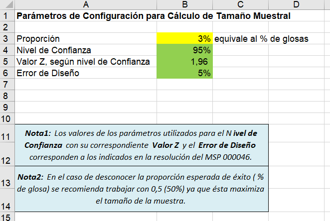
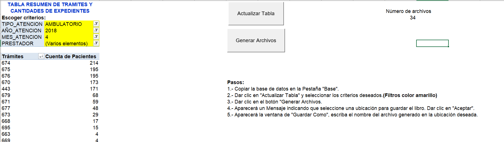

Problemática:
El Sistema Nacional de Salud creó un tarifario único para que los diferentes prestadores privados puedan atender a los usuarios afiliados a la Seguridad Social y a los pacientes derivados por el Ministerio de Salud Pública. Para proceder con la autorización del pago de dichas prestaciones, la historia clínica con todo lo registrado en la atención debería ser auditado y validado antes de que se proceda con el pago de la prestación, en caso de encontrar algún error, se procede a glosar total o parcialmente el pago.
Dada la cantidad de prestaciones por auditar, el tiempo de pago de las prestaciones auditadas llegó a tomar más de un año, generando problemas financieros en algunos prestadores de salud.
Ante toda la problemática generada y dado que resultaba imposible e ineficiente realizar las auditorías a todas las distintas prestaciones realizadas, y con la finalidad de agilizar las auditorías y los pagos para los prestadores, se publica la norma “Norma para aplicar métodos estadísticos en el control técnico médico de pertinencia médica en las instituciones de la red integral de salud, respecto de las prestaciones de salud otorgadas por los establecimientos de la salud públicos y privados” – resolución MSP 0000046, que permite el uso de métodos estadísticos para clasificar y  muestrear los trámites según el grupo a la que se asocien.
En base a la resolución MSP 0000046, se desarrolla una plantilla que en base a los listados recibidos se obtengan los grupos asociados, y una muestra aleatoria y representativa para ser auditada por el personal responsable. El muestreo se realiza a nivel de cada trámite

Presentación de la pantalla de Configuración:

Pantalla para ejecución de aleatorización de archivos:
